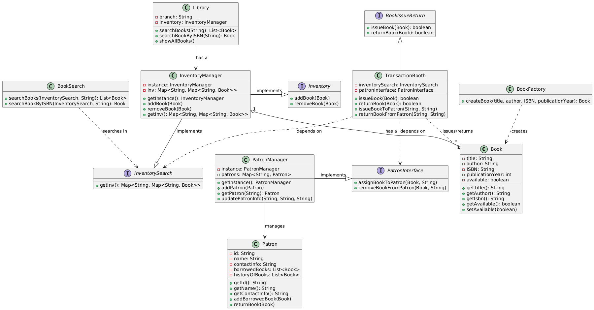

# Library Management System

## Overview
The **Library Management System** is a Java-based application designed to manage books, patrons, and book transactions efficiently. It follows **SOLID principles** and uses **design patterns** to ensure modularity, scalability, and maintainability.

## Features
- **Book Management** 
  - Add, remove, search books
- **Patron Management** 
  - Add, update, search patrons
- **Book Transactions** 
  - Issue and return books
- **Book Search** 
  - By title, author, or ISBN

## Design Patterns Used
- Singleton – Used in InventoryManager and PatronManager to ensure a single instance.
- Factory – Used in BookFactory to create books.
- Interface Segregation – Inventory was split into BookIssueReturn & InventoryLookup.
- Dependency Inversion – TransactionBooth depends on PatronInterface instead of PatronManager.

## Class Diagram
